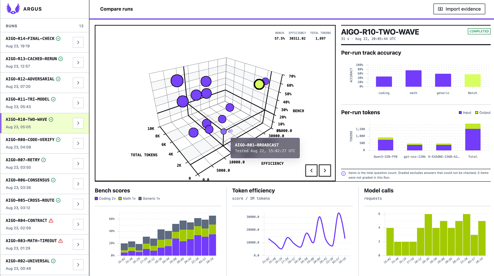
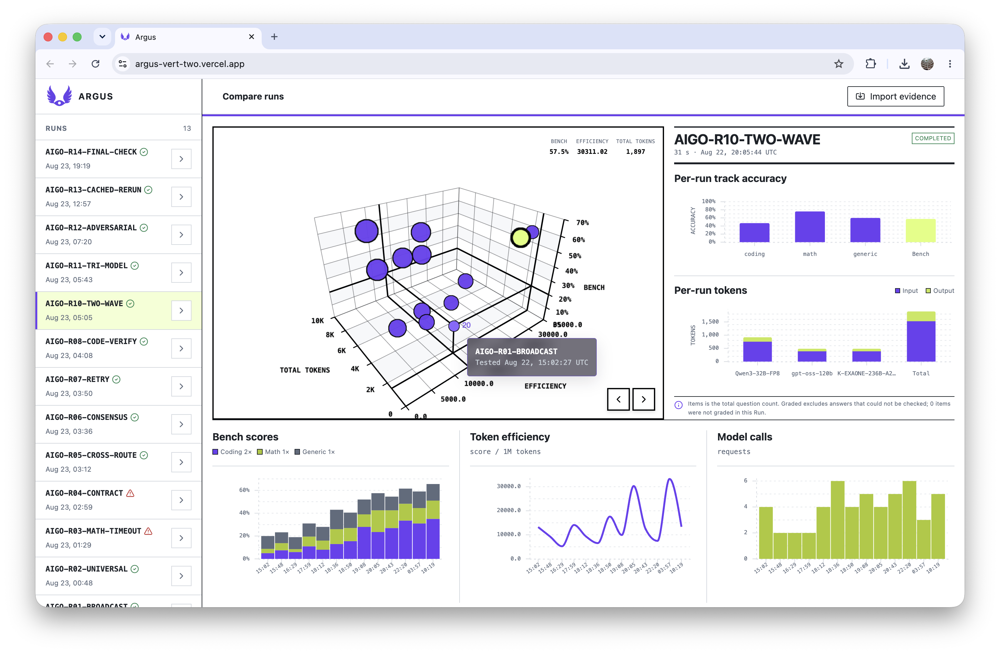
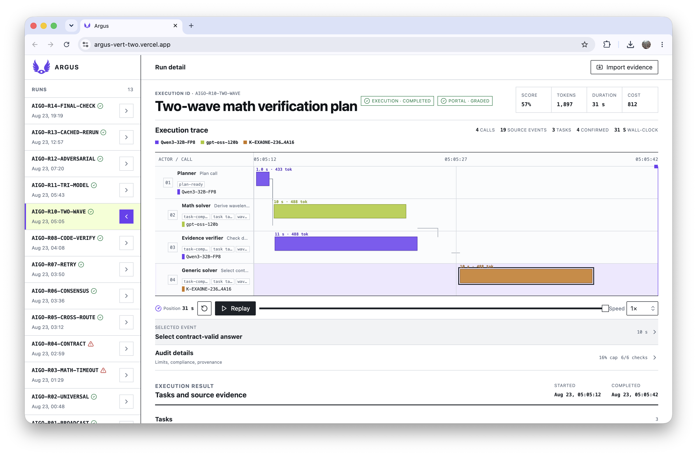

<div align="center">
  
  <h1>ARGUS</h1>
  <h3>Compare agent runs. See what made the difference.</h3>
  <p>
    <a href="https://gb.go.kr/Main/governor/page.do?BD_CODE=bbs_bodo&amp;B_LEVEL=0&amp;B_NUM=514627801&amp;B_STEP=514627800&amp;Start=0&amp;V_NUM=14781&amp;bdName=&amp;cmd=2&amp;dept_code=&amp;dept_name=&amp;key=4&amp;mnu_uid=6792&amp;p1=0&amp;p2=0&amp;tbbscode1=bbs_bodo&amp;word=">
      
    </a>
  </p>
  <p><strong>Built by Demo Day Care</strong> for the Lablup × FuriosaAI track.</p>
  <p>
    <a href="https://www.lablup.com/blog/culture/2026-08-junctionx-hackathon-retrospective"><strong>Read Lablup's official JunctionX retrospective →</strong></a>
    ·
    <a href="https://www.lablup.com/ko/blog/culture/2026-08-junctionx-hackathon-retrospective">한국어</a>
  </p>
  <p>
    
    
    
    
    
    
  </p>
</div>

<p align="center">
  
</p>

<p align="center">
  <a href="#quick-start">Quick Start</a> ·
  <a href="#our-methodology">Methodology</a> ·
  <a href="#see-performance-as-a-space">Compare Runs</a> ·
  <a href="#read-execution-in-the-coordinate-system-it-happened-in">Run Detail</a> ·
  <a href="#the-visualization-principles">Principles</a> ·
  <a href="#team-demo-day-care">Team</a> ·
  <a href="#press-coverage">Press</a>
</p>

---

Agent runs involve planning, delegation, model calls, parallel work, verification, and recovery. A score hides that process, while raw logs make it hard to see.

We built ARGUS to make key metrics across agent runs easy to understand at a glance.

## Press coverage

Selected coverage of JunctionX Korea 2026 and Demo Day Care's Final Winner award:

- [시사저널 — \[경북 24시\] 경북도, ‘정션 엑스 코리아 해커톤 대회’ 개최…AI 기반 서비스 발굴](https://www.sisajournal.com/news/articleView.html?idxno=384804)
- [이로운넷 — 경북도, AI와 공공데이터의 만남…현안 해결에 글로벌 혁신가들 머리 맞댔다](https://www.eroun.net/news/articleView.html?idxno=88374)
- [대구신문 — 공공데이터로 본 지역문제, AI로 풀다](https://www.idaegu.co.kr/news/articleView.html?idxno=557588)

**[Read all 18 press articles →](press.md)**

## Quick Start

**Requirements:** Node.js 20.19+ on the 20.x line, or Node.js 22.12+, with npm.

```bash
git clone https://github.com/peer-problem/argus.git
cd argus
npm ci
npm run dev
```

Open [http://127.0.0.1:4173](http://127.0.0.1:4173) in your browser. To run the test suite and create a production build, use `npm run validate`.

## Our methodology

### Overview → deviation → evidence

ARGUS follows the natural sequence of an investigation:

1. **Observe the population.** Understand the range of outcomes and the trade-offs across runs.
2. **Locate the deviation.** Find the run, model, track, or moment that breaks the expected pattern.
3. **Explain the cause.** Reconstruct the execution and inspect the evidence behind the anomaly.

The two pages are not separate dashboards, but two resolutions of the same question. **Compare Runs** provides breadth; **Run Detail** provides causality. Selection connects them so the user can move from pattern to proof without rebuilding context.

## See performance as a space



The **Compare Runs** view places every run inside a three-dimensional decision space: benchmark score, total tokens, and token efficiency. These axes were chosen because they describe the central tension in agent evaluation: the quality produced, the resources consumed, and the value obtained from those resources.

A run is not presented as simply “better” or “worse.” Position shows its balance of quality and resource use; distance and clustering reveal relationships before the user reads a row of data. The selected run becomes a stable visual anchor while the surrounding views explain its composition.

The surrounding charts preserve the context that a single ranking removes:

- **Track accuracy** reveals where quality was gained or lost.
- **Input and output tokens** expose each model’s share of the budget.
- **Score, efficiency, and model calls over time** make regressions and outliers visible.

Aligned time axes and repeated colors let the user compare change without repeatedly decoding the interface. Bars show discrete composition and magnitude, the line shows efficiency as a continuous signal, and the 3D field is reserved for the relationship among three competing measures.

This makes comparison actionable. Did a score improve because one track improved? Did efficiency rise because fewer calls were made? The overview identifies the run worth investigating; the linked detail explains what made it different.

## Read execution in the coordinate system it happened in



The **Run Detail** view reconstructs an execution on a shared wall-clock. Each row represents an actor and call; position shows when it occurred, length shows duration, color identifies the model, and connectors preserve task dependencies. Token use stays attached to the call that produced it.

Time is the common coordinate because it reveals what tables cannot: sequence, concurrency, idle gaps, slow calls, and the handoff where behavior changed. A single scan distinguishes parallel work from events that merely appear adjacent in a log.

**Replay** restores the order in which information became available, turning a completed trace into a causal narrative. Event selection leads to the underlying record, while audit details expose limits, compliance, and provenance. The same view supports a fast behavioral read and a slower forensic one.

## The visualization principles

**Structure before detail.** The first view answers “where should I look?” before asking the user to inspect individual events.

**Trade-offs over vanity metrics.** Quality, tokens, latency, and model calls remain visible together so improvement in one dimension cannot conceal regression in another.

**One visual variable, one job.** Position communicates time or performance space, length communicates magnitude or duration, color identifies categories, and emphasis communicates selection.

**Evidence over reconstruction theater.** Actors, models, tasks, checks, and provenance are derived from the imported run rather than imposed by a fixed roster. When a relationship is inferred rather than observed, ARGUS says so.

**Progressive disclosure over indiscriminate density.** The first read stays visual. Events, limits, compliance, and provenance appear when the investigation requires them.

**Consistency across scale.** The selected run remains the subject of its supporting charts and detailed trace, carrying context forward through every transition.

## Team Demo Day Care

<p align="center">
  
</p>

| Name                | GitHub                                                     | Role                                                                                  |
| ------------------- | ---------------------------------------------------------- | ------------------------------------------------------------------------------------- |
| Johnny SeokHyun Bae | [@jbaehova](https://github.com/jbaehova)                   | Agent orchestration, system architecture, and benchmark strategy                      |
| Jaewon Lee          | [@leejaywon](https://github.com/leejaywon)                 | UI/UX, frontend development, benchmark analysis, and agent orchestration optimization |
| Wonseok Yoo         | [@spark142857142857](https://github.com/spark142857142857) | AI:GO integration, candidate validation, and evidence compliance                      |
| Rokyeon Kim         | [@rrrrok](https://github.com/rrrrok)                       | Data contracts, prompt composition, and token and context metrics                     |

## MVP limitations

ARGUS is a hackathon MVP. The web build visualizes bundled demo records or manually imported compatible ARGUS run JSON
